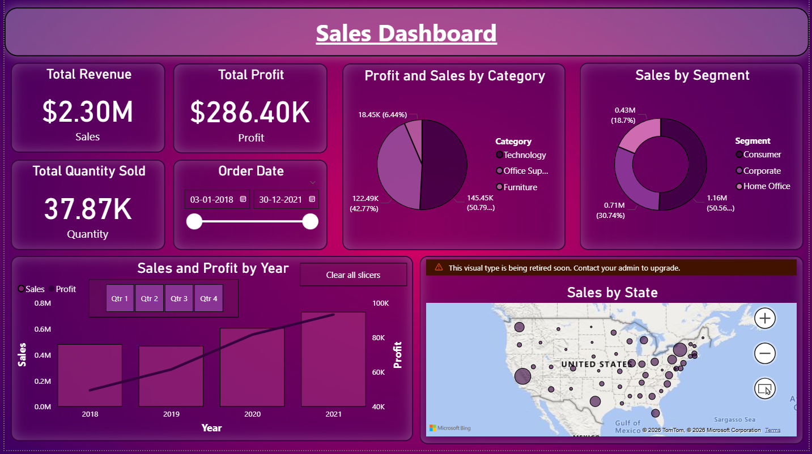

# Superstore Sales Dashboard (Power BI)

## Objective
To analyze retail sales data and extract insights on performance across categories, regions, and customer segments.

---

## Tools Used
- Power BI  
- Excel 

---

## Dataset
- Superstore dataset (CSV)  
 

---

## Dashboard Preview

### Sales Overview

### Category & Sub-Category Analysis

### Region & State Analysis

---

## Key Insights
- Technology category generates the highest revenue  
- Consumer segment contributes the largest share of sales  
- Profitability varies significantly across regions and states  
- Sales show a consistent upward trend over the years  
